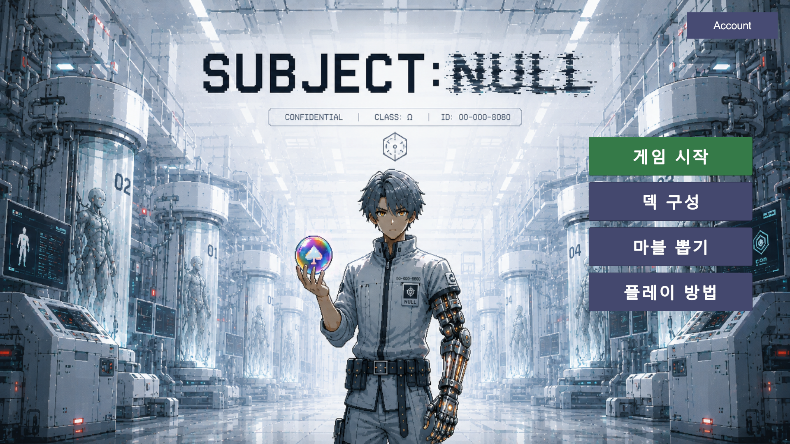
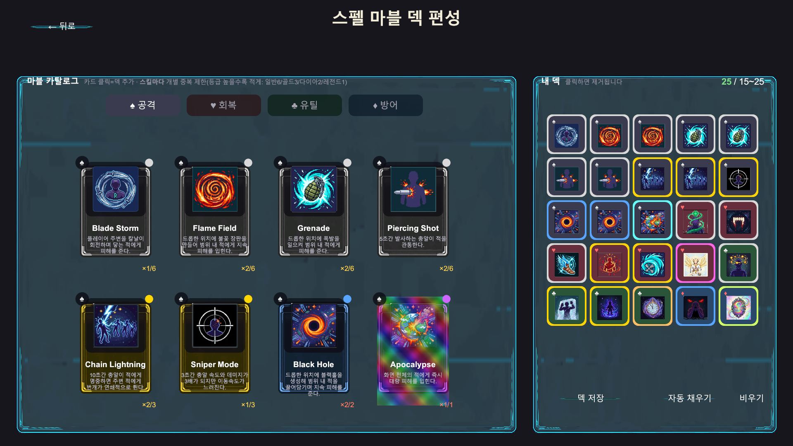
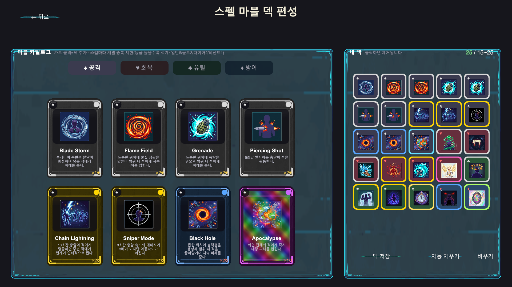
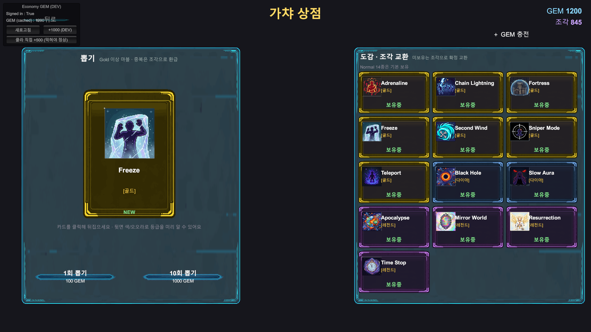
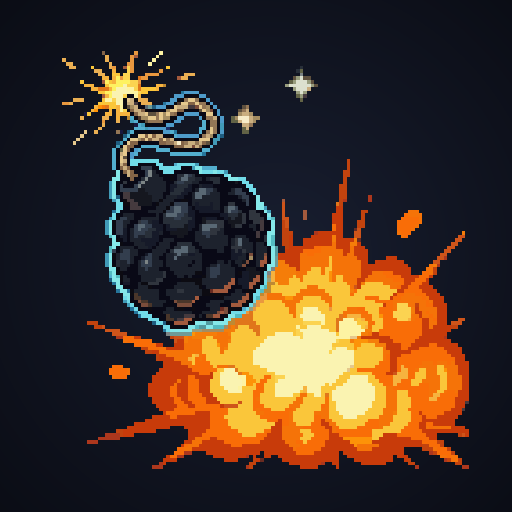

# 게임을 만들어 본 적 없는 사람이 5주 만에 게임을 출시한 기록

> Claude Code와 MCP로 만든 첫 게임, SUBJECT:NULL
> 2026.06.27 ~ 07.31

---

## 들어가며

<!-- ✍️ 여기는 직접 쓰셔야 합니다 -->
<!-- - 왜 갑자기 게임을 만들려고 했는지
     - 그전에 게임 개발 경험이 정말 없었는지 (Unity를 켜본 적은 있는지)
     - 개발자이긴 한지, 아니면 완전 다른 일을 하는지
     이 문단이 글 전체의 톤을 정합니다. 나머지는 사실 위에 얹으면 됩니다. -->

5주 뒤 결과부터 말하면 이렇습니다.

- **[subjectnull.netlify.app](https://subjectnull.netlify.app)** — 브라우저에서 바로 플레이
- C# 176개 파일, 18,312줄
- 스펠 오브 34종, 적 7종
- 계정·랭킹·가챠 서버, **실제 PayPal 결제**

혼자 만들었지만 혼자 만들지 않았습니다. Claude Code가 코드를 쓰고, MCP들이 Unity 에디터를 조작하고 도트를 그리고 브라우저를 열었습니다.



---

## 1. 도구 구성

이 글의 핵심입니다. 뭘 어떻게 붙여 썼는지.

| 도구 | 역할 |
|---|---|
| **Claude Code** | 코드 작성, 설계, 디버깅 |
| **UnityMCP** | Unity 에디터 직접 조작 — 씬 수정, 에셋 생성, 플레이 모드 검증, 빌드 |
| **PixelLab MCP** | AI 도트 생성 — 적·플레이어·UI·스킬 아이콘 |
| **Aseprite MCP** | 도트 수작업 — 20×20 작은 스프라이트 |
| **Chrome MCP** | 빌드 결과 브라우저 검증 |
| **UGS CLI / Netlify CLI** | 서버 배포, 웹 배포 |

가장 결정적이었던 건 **UnityMCP**입니다.

보통 AI에게 게임 코드를 짜달라고 하면 "이 스크립트를 이 오브젝트에 붙이세요"까지가 끝입니다. UnityMCP가 붙으면 그 다음이 생깁니다. **AI가 직접 플레이 모드를 켜고, 값을 읽고, 자기가 짠 코드가 실제로 동작하는지 확인합니다.**

실제로 이런 식으로 굴러갔습니다.

```
나: "대시 중 무적인데 근접 적한테 쓰면 그냥 맞아"
AI: (플레이 모드 진입 → 스킬 발동 → 실드 상태 읽음)
    "무적이 0.35초인데 이동이 0.12초입니다.
     적 옆에 착지한 뒤 0.23초 만에 풀려서 접촉 피해를 맞습니다."
```

추측이 아니라 **측정**입니다. 이게 되고 안 되고가 체감 차이가 컸습니다.

<!-- 📸 필요: UnityMCP가 플레이 모드에서 값 읽는 콘솔 캡처 -->

---

## 2. 5주 타임라인

37개 커밋을 주 단위로 묶으면 이렇습니다.

### 1주차 (6/27~7/2) — 일단 움직이게

`first commit` → `UI 추가 + HP 바 추가` → `확장성을 고려한 구조 변경`

3일 만에 "구조 변경"이 들어간 게 눈에 띕니다. 처음엔 되는 대로 짰고, 바로 갈아엎었습니다.

### 2주차 (7/3~7/9) — 스펠 시스템

`스테미너 추가 및 원거리 적 추가` → `스펠마블 기능 구현중` → `스킬 설명창 및 이펙트, 소리 추가`

게임의 핵심인 스펠 시스템이 이때 나왔습니다. 트럼프 문양(♠♥♣♦)으로 타입을 나누고 등급을 붙이는 구조입니다.

### 3주차 (7/10~7/16) — 서버와 배포

`LoginScene/부트 구조 + 가챠 Stage 1` → `결제 기능 추가중` → `총알 디자인 변경 및 웹 Netlify 배포`

**여기서 게임이 "웹에 있는 것"이 됐습니다.** 계정, 가챠, 랭킹이 서버로 올라갔습니다.

### 4주차 (7/17~7/24) — 다듬기

`드론 힐 스킬 사용 시 과거 이미지가 보이는 현상 수정` → `폰트 변경` → `마우스 포인터 변경 및 고난 추가`

커밋 메시지가 갑자기 잘아집니다. 만드는 단계에서 **고치는 단계**로 넘어간 시점입니다.

### 5주차 (7/25~7/31) — 결제와 마무리

`paypal 결제 테스트까지 추가` → `스펠 오브 홀로그램 겹침 버그 수정` → `Void Slash 스펠 추가`

---

## 3. UI는 한 번에 나오지 않았다

개발 중 캡처가 29장 남았는데, 대부분 **고치는 과정**입니다.

### 덱 구성 화면

| | |
|---|---|
|  |  |
| 첫 프레임 | 세 번째 |



`deck_frame_v2` → `v2b` → `v3` → `deck_final`. 네 번 갈아엎었습니다.

### 가챠 화면



`gacha_frame_v3` → `v3b` → `gacha_fix1` → `gacha_final`.

<!-- ✍️ 각 단계에서 뭐가 마음에 안 들었는지 한 줄씩 붙이면 훨씬 읽힙니다.
     예: "v2는 프레임이 두꺼워서 카드가 답답해 보였다" -->

---

## 4. 도트는 어떻게 만들었나

그림을 못 그립니다. 두 가지 MCP를 나눠 썼습니다.

### PixelLab — AI 생성

적 7종(슬라임/탱크슬라임/박쥐/샷건박쥐/레이저박쥐/개구리/힐드론)을 전부 **"실험실 표본 몬스터"** 컨셉으로 통일했습니다.

핵심은 `style_images` 옵션입니다. 플레이어 스프라이트를 참조로 넣으면 톤이 맞춰집니다. 안 그러면 적마다 화풍이 따로 놉니다.

```
create_1_direction_object(
  description="빛나는 코어를 가진 실험체 몬스터",
  style_images=[<플레이어 스프라이트>]   ← 이게 핵심
)
→ animate_object(frame_count=6)
→ 시트 합성 → Unity 임포트
```

**함정:** 애니메이션 큐에 "30~60초"라고 뜨는데 **실제로는 7분** 걸립니다. 여러 개 걸어두고 딴 일 하는 게 맞습니다.

### Aseprite — 수작업

작은 스프라이트(20×20)는 AI보다 직접 그리는 게 나았습니다. 개구리를 한 번 AI로 뽑았는데 개구리처럼 안 생겨서 결국 손으로 그렸습니다.

**둘의 경계가 명확합니다.**

- Aseprite MCP: 16~20px 캐릭터 ✅ / 정교한 일러스트 ❌
- PixelLab: 일러스트급 아이콘 ✅ / 픽셀 단위 통제 ❌

스킬 아이콘 34종은 전부 PixelLab입니다.



---

## 5. 삽질 모음

개발기의 본편입니다. 하루씩 날린 것들.

### WebGL에서 한글만 사라졌다

에디터에서는 멀쩡한데 브라우저 빌드에서 **한글만 투명하게** 사라졌습니다. 영문과 숫자는 나옵니다.

원인: Unity Legacy Text의 기본 폰트에 한글 글리프가 없습니다. 에디터·윈도우에서는 **OS 폰트 폴백**이 대신 그려주는데, WebGL은 OS 폰트에 접근을 못 합니다.

"에디터에서 되니까 되겠지"가 안 통하는 대표 사례였습니다.

### 서버에 `fetch`가 없다

결제 붙이면서 Unity 게임 서버(Cloud Code)에서 PayPal API를 불러야 했는데, 계속 실패했습니다.

원인: 그 JS 런타임에는 **`fetch`도 `Buffer`도 없습니다.** `axios`를 명시적으로 불러야 합니다.

```js
const axios = require("axios-1.6");   // fetch 없음
```

### 응답에 필드를 하나 늘렸더니 결제가 깨졌다

이게 제일 고약했습니다.

진단하려고 서버 응답에 `env` 필드 하나를 추가했더니 **결제가 통째로 실패**했습니다. 돈은 빠져나가고 젬은 안 들어옵니다.

원인: Unity Cloud Code SDK는 **클라이언트 클래스에 없는 필드가 응답에 있으면 예외를 던집니다.** 서버만 고치면 안 되고 C# 클래스도 같이 고쳐서 다시 빌드해야 합니다.

지금은 코드에 경고를 박아뒀습니다.

```js
// ⚠️ 응답 필드를 늘리지 말 것 (DeserializationException)
return { orderId: orderId };
```

### PayPal이 한국 국내 거래를 막는다

**실제 결제를 끝까지 검증하지 못했습니다.**

한국 판매자 ↔ 한국 구매자 거래를 PayPal이 차단합니다. 샌드박스에서는 전부 통과했는데 라이브에서 막혔습니다. 이건 코드 문제가 아니라 정책이라 우회할 방법이 없습니다.

<!-- ✍️ 이 부분 어떻게 마무리할지 정해야 합니다. 해외 계정으로 검증 예정인지, 결제 수단을 바꿀 건지 -->

### 전체 화면에서만 UI가 겹쳤다

스펠 아이콘 5개가 창 모드에서는 멀쩡한데 전체 화면에서만 겹쳤습니다.

두 번 잘못 짚었습니다. 세 번째에 원인을 찾았습니다.

```csharp
float scale = slot.lossyScale.y;          // 캔버스 배율이 이미 들어있음
panels[i].localScale = Vector3.one * scale;  // 부모도 같은 배율 → 제곱
```

배율이 **제곱으로** 적용되고 있었습니다. 기준 해상도에서는 배율이 1이라 제곱해도 1이어서 안 보이다가, 전체 화면에서 1.5가 되면 2.25배가 됩니다.

| 캔버스 배율 | 패널 실제 배율 |
|---|---|
| 1.0 (창) | 1.0 — 정상 |
| 1.5 (전체화면) | **2.25** — 겹침 |

**"특정 조건에서만 터지는 버그"는 대체로 그 조건에서만 1이 아닌 값이 곱해집니다.**

### 컴포넌트를 껐는데 예약된 함수는 실행됐다

시간 정지 스킬을 쓰면 **멈춰 있어야 할 적에게 갑자기 맞는** 현상이 있었습니다.

원인: 적 등장 처리에 `Invoke(nameof(StartMoving), 1f)`를 썼는데, **`Invoke`는 컴포넌트를 비활성화해도 계속 진행됩니다.** 시간 정지는 컴포넌트를 꺼서 적을 멈추는 방식이라, 정지된 세상에서도 1초 뒤 충돌 판정이 켜졌습니다.

`FixedUpdate` 카운트다운으로 바꿔서 해결했습니다. 컴포넌트가 꺼지면 타이머도 같이 멈춥니다.

### 비활성 오브젝트에 설정한 값이 조용히 사라진다

툴팁이 아이콘 뒤에 가려지는 문제로 **네 번** 실패했습니다.

원인: `Canvas.overrideSorting`을 **비활성 상태인 오브젝트에 설정하면 조용히 false로 되돌아갑니다.** Unity가 부모 캔버스를 못 찾아서입니다. 에러도 경고도 없습니다.

활성화한 **뒤에** 설정하도록 바꿔서 해결했습니다.

<!-- ✍️ 이때 심정 한 줄 있으면 좋습니다 -->

---

## 6. AI와 일하면서 배운 것

### "측정해봐"가 제일 강한 요청

AI도 추측하면 틀립니다. 위의 UI 겹침 버그도 제가 두 번 잘못 짚었습니다.

바뀐 건 **"플레이 모드 켜서 실제 값 읽어봐"**라고 요구하기 시작한 다음부터입니다. UnityMCP가 있으니 가능한 요구였고, 그때부터 추측 대신 숫자가 나왔습니다.

### 함정은 기록해두지 않으면 반드시 다시 밟는다

위의 삽질들은 대부분 **한 번 겪고, 잊고, 또 겪은** 것들입니다.

지금은 코드 주석에 직접 박아둡니다.

```js
// ⚠️ Sandbox → Live 전환 시 겪은 함정: 셋 다 바꿔야 함 / 환경 레벨 최우선 / 5분 캐시
```

문서는 안 읽게 되는데 주석은 그 코드를 고칠 때 반드시 봅니다.

### 저장 키는 표시 이름과 분리해야 한다

스킬 이름을 두 번 바꿨습니다(`부활` → 다른 능력, `Blink Strike` → `Void Slash`). 그때마다 문제가 된 게 **이미 그걸 가지고 있는 플레이어의 데이터**입니다.

지금은 규칙이 명확합니다.

- **저장 키**(`void-slash`) — 한 번 정하면 절대 안 바꿈
- **표시 이름**(`Void Slash`) — 자유롭게 바꿈

이름을 바꿔야 하면 별칭을 남깁니다.

```csharp
{ "blink-strike", "void-slash" },   // 2026-07-31 개명
```

<!-- ✍️ 이 섹션에 개인적인 배움 하나쯤 더 있으면 좋습니다.
     기술 얘기 말고 "AI랑 일한다는 게 어떤 느낌이었나" 쪽으로 -->

---

## 7. 지금

<!-- 📸 필요: 실제 게임플레이 화면 3~4장
     - 전투 중 (적 여러 마리 + 총알)
     - 스펠 오브 벨트 (Shift 눌러 아이콘 뜬 상태)
     - 조커 발동 (붉은 사이렌)
     - Void Slash 참격 순간 -->

**[subjectnull.netlify.app](https://subjectnull.netlify.app)** 에서 바로 해보실 수 있습니다.

<!-- ✍️ 마무리
     - 5주 전과 지금, 뭐가 제일 달라졌는지
     - 다음에 뭘 할 건지
     - 같은 걸 해보려는 사람에게 한마디 -->

---

<!--
📋 남은 작업

[ ] ✍️ 표시된 6곳 — 본인 목소리로 채우기 (특히 들어가며, 마무리)
[ ] 📸 게임플레이 캡처 4장 — Unity 연결 후 촬영 가능
[ ] 📸 UnityMCP 검증 장면 캡처
[ ] 이미지 경로를 블로그 플랫폼에 맞게 변경
[ ] PayPal 한국 결제 건 처리 방향 정하기

제목 후보
- 게임을 만들어 본 적 없는 사람이 5주 만에 게임을 출시한 기록
- Claude Code와 MCP로 만든 첫 게임
- 18,312줄, 37커밋, 5주 — 첫 게임 개발기
-->
