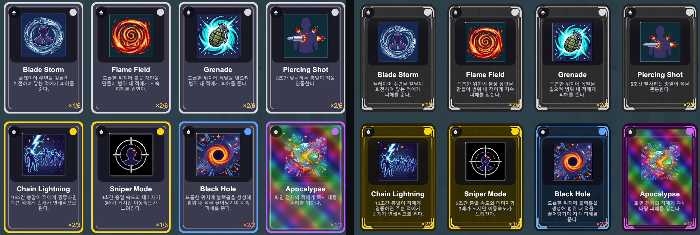
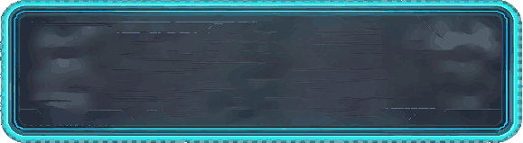
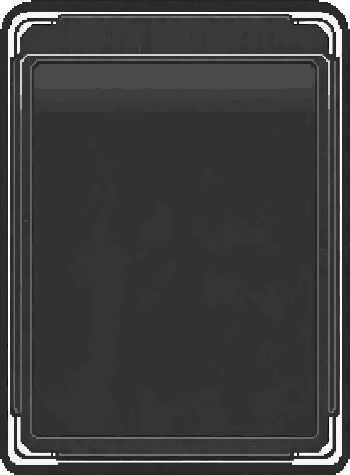
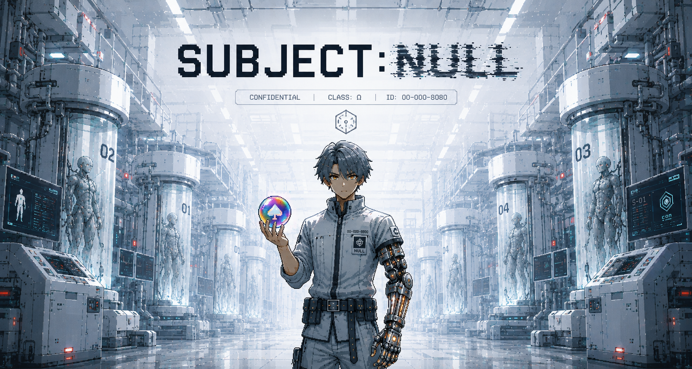

# 4편 자료 — AI로 UI와 일러스트 만들기

> 그림판으로 찍어낸 것 같던 UI를 실험실 느낌으로 갈아엎고,
> 메인 화면 배경 일러스트를 만든 단계.

---

## 문제 — UI만 겉돌았다

캐릭터와 적은 도트로 통일했는데(3편), **UI가 따로 놀았다.**

게임은 "실험실에서 탈출한 실험체" 이야기인데, 버튼은 그냥 회색 사각형이고 패널은 반투명 검정 박스였다. 코드로 색만 찍어 만든 것들이라 그림판으로 대충 그린 것처럼 보였다.

문제는 UI가 **화면의 절반**을 차지한다는 점이다. 덱 구성, 가챠, 설정, 일시정지 — 게임플레이만큼 오래 보는 화면이다.



왼쪽이 전, 오른쪽이 후. 카드 테두리가 **코드로 그린 둥근 사각형**에서 **금속 프레임**으로 바뀌었다.
위쪽 걸쇠와 모서리 리벳이 생기면서 "표본 카드"처럼 보인다.

---

## PixelLab로 UI 프레임 만들기

`create_ui_asset`으로 패널·버튼 프레임을 뽑았다.

컨셉은 캐릭터와 같은 **"실험실"** — 청록 네온 테두리, 금속 질감, 관찰 창.

| 만든 것             | 크기    | 쓰이는 곳                                   |
| ------------------- | ------- | ------------------------------------------- |
| `SubjectNullButton` | 579×159 | **9곳** — 로그인·덱·가챠·설정·일시정지 전부 |
| `LabDossierPanel`   | 291×158 | **9곳** — 패널 배경                         |
| `SpecimenCardFrame` | 350×475 | 덱·가챠 카드 프레임                         |
| `StaminaTrack`      | 550×99  | 스태미너 게이지 틀                          |
| `HologramPanel`     | 160×81  | 스펠 아이콘 홀로그램                        |

버튼 하나가 9곳에서 쓰인다. **UI 부품 몇 개로 게임 전체 인상이 바뀐다.**

실제 에셋:

| 버튼 | 카드 프레임 |
|---|---|
|  |  |

둘 다 **속이 비어 있다.** 내용은 코드가 채우고, 이 이미지는 테두리만 담당한다.

---

## 핵심은 9-슬라이스

UI 프레임은 그냥 넣으면 안 된다.

버튼은 글자 길이에 따라, 패널은 내용에 따라 **크기가 제각각**이다. 이미지를 그대로 늘리면 모서리의 둥근 부분과 테두리 장식까지 같이 늘어나 뭉개진다.

9-슬라이스는 이미지를 아홉 조각으로 나눠서, **모서리는 그대로 두고 가운데만 늘린다.**

```
┌──┬────────┬──┐   모서리 4개  = 고정
│  │        │  │   변 4개      = 한 방향만 늘림
├──┼────────┼──┤   가운데      = 양방향 늘림
│  │  늘림  │  │
├──┼────────┼──┤
│  │        │  │
└──┴────────┴──┘
```

실제로 설정한 값:

| 에셋              | border (좌·하·우·상)  |
| ----------------- | --------------------- |
| SubjectNullButton | 22 / 22 / 22 / 22     |
| LabDossierPanel   | 34 / 34 / 34 / 34     |
| SpecimenCardFrame | 12 / 16 / 12 / **58** |
| StaminaTrack      | 20 / 16 / 20 / 16     |

카드 프레임만 위쪽이 58인데, **위에 제목 띠가 있어서** 그 부분을 늘리면 안 되기 때문이다.

### 여기서 한 번 헤맸다

`border` 값을 "프레임 두께"로 착각했다. 실제로는 **"늘리지 않을 가장자리 두께"**다.

스태미너 게이지를 프레임 안쪽에 딱 맞추려고 border 값(22, 8)을 여백으로 썼더니 가로는 넘치고 세로는 모자랐다. 결국 스프라이트 픽셀을 직접 훑어서 프레임 안쪽 경계를 재는 방식으로 바꿨다.

또 하나 — 9-슬라이스로 렌더되는 테두리 두께는 `pixelsPerUnit`에 **반비례**한다. 프레임이 너무 두꺼우면 ppu를 올려서 얇게 만들 수 있다.

---

## PixelLab UI의 함정

**결과가 시트로 온다**

`create_ui_asset`은 한 장에 **여러 변형을 담아서** 준다. 버튼 하나를 요청해도 5~6개 시안이 격자로 붙어 나온다. 원하는 하나를 골라 잘라 써야 한다.

**Resources 폴더에 둬야 런타임에 부른다**

이 프로젝트의 UI는 씬 배선 없이 코드로 만든다. 그래서 `Resources.Load`로 불러야 하고, 그러려면 `Assets/Resources/` 아래에 있어야 한다.

---

## 메인 화면 배경은 ChatGPT로

UI 부품은 도트로 되는데, **타이틀 화면 일러스트**는 다른 문제였다.

메인 화면은 게임의 첫인상이다. 여기만큼은 도트가 아니라 제대로 된 일러스트가 필요했다. PixelLab은 도트 생성 도구라 이런 건 못 만든다.

ChatGPT 이미지 생성으로 만들었다. **1672×894**.



**담은 것**

- 배양관이 늘어선 실험실 복도
- 관 안에 서 있는 실험체들 (01, 02, 03, 04 번호가 붙어 있다)
- 가운데 주인공 — 한쪽 팔이 기계
- 손에 든 스펠 오브 (♠ 문양, 무지개빛 = 레전드 등급)
- 상단 **SUBJECT:NULL** 로고 — NULL 쪽만 노이즈 느낌나게

**게임 설정이 그림 하나에 다 들어갔다.** 실험체 번호, 기밀 등급, 스펠 오브, 기계 팔 — 텍스트로 설명할 필요가 없어졌다.

이 그림은 **로그인 화면과 메인 메뉴 두 곳**의 배경으로 쓰인다.

---

## 도구를 나눠 쓴 기준

|              | 쓴 곳                     | 이유                                                |
| ------------ | ------------------------- | --------------------------------------------------- |
| **PixelLab** | UI 프레임, 아이콘, 캐릭터 | 게임 화면 안에 들어가는 것 — 도트와 톤이 맞아야 함  |
| **ChatGPT**  | 타이틀 일러스트           | 화면을 통째로 채우는 그림 — 도트로는 밀도가 안 나옴 |

게임 안은 도트로 통일하고, **게임 밖(타이틀)은 일러스트**로 갔다.

---

## 결과

|                 |                                                            |
| --------------- | ---------------------------------------------------------- |
| UI 프레임       | 5종 (버튼·패널·카드·게이지·홀로그램)                       |
| 적용 화면       | 로그인 / 메인메뉴 / 덱 / 가챠 / 설정 / 일시정지 / 게임오버 |
| 타이틀 일러스트 | 1672×894, 2개 화면 배경                                    |

---

## 자료에 없는 것 (본인만 아는 부분)

- 기존 UI가 안 맞는다고 느낀 순간 = 버튼 기능을 다 만들고 게임을 처음부터 실행해봤을때
- ChatGPT에 어떤 프롬프트를 넣었는지, 몇 번 다시 뽑았는지 = @이미지 만들기
  게임 타이틀 스크린용 키아트, 클리니컬 화이트 사이파이 실험실 컨셉. 주제: 밝고 새하얀 실험실 안에 서있는 인물. 오른팔이 총열이 노출된 기계 의수로 개조되어 있음, 팔 관절 사이로 은은한 빛(시안 또는 앰버색)이 새어나옴. 구도: 정면 또는 살짝 로우앵글. 인물은 화면 중앙 또는 하단에 배치, 상단에 타이틀 로고 들어갈 여백 남김. 배경: 밝은 화이트/라이트그레이 톤의 실험실. 깨끗한 유리 캡슐, 스테인리스 배관, 밝은 형광등/LED 조명들이 초점 흐리게 뒤로 물러나 있음. 그림자는 짧고 선명하게, 채광이 강한 느낌. 조명: 위에서 떨어지는 밝고 균일한 조명. 인물 실루엣이 어둡게 죽지 않고 디테일이 살아있는 정도로, 의수 부분만 포인트 라이트로 강조. 색상: 화이트/라이트그레이/스틸블루 베이스, 시안 또는 앰버 포인트 컬러, 붉은 경고등 소량. 채도는 낮은 편이지만 전체적으로 밝고 클린한 톤. 분위기: 무균실 같은 청결함과 통제된 느낌. "밝지만 어딘가 비인간적이고 관찰당하는 듯한 불편함"이 배어있는 톤 — 밝다고 안전하거나 따뜻한 느낌은 아님. 타이포그래피(로고) 참고: "SUBJECT: NULL" 텍스트는 의료 서류/모니터 UI 느낌의 각진 산세리프 폰트로, 다크 네이비 또는 블랙 컬러로 배치해서 밝은 배경 위에서도 잘 읽히게. 전체 스타일: 클린 사이파이, 시네마틱 조명, 밝지만 차갑고 통제된 색감. 따뜻하거나 아늑한 느낌은 배제.

프롬프트는 펼치고 접을 수 있게 - 가능하면 4번만에 뽑음

- 일러스트가 나왔을 때 어땠는지 - 매우 높은 퀄리티에 놀람 AI가 빠르게 발전하고 있다는것을 체감함
- 도트와 일러스트를 섞는 게 어색하지 않을까 고민했는지 - 일러스트가 너무 고퀄리티일 경우 도트 게임과 대비 했을때 뭔가 이질감(?) 이 느껴질거 같아서 일러스트도 도트 느낌이 나는 일러스트로 뽑아달라함
